**Grid2demand**

\*How to quickly generate **initial origin-destination transportation demand**
for engaging traffic simulation games such as A/B street and DTALite?
\*How to teach our undergraduate students the important **trip generation and
trip distribution steps**, using their own beautiful campus as examples?
\*How to analyze the resident locations and other land use properties using
flexible **grid zones, based on POI data from OpenStreetMap** data and using
**open transportation modeling format**


**Starting with Grid2demand**
If you have not used Grid2demand before, here are some advices to get started.

1. Read the user guide or watch the video at https://www.youtube.com/watch?v=EfjCERQQGTs.

2. Obtain a map.osm or map.osm.pbf file for your area of interest at https://extract.bbbike.org/ or openstreetmap.org

3. Look at the examples at Google colab environment https://github.com/asu-trans-ai-lab/grid2demand/blob/main/grid2demand_tutorial.ipynb

4. Install Python, Grid2demand and QGIS on your computer or using Google Colab environment to modify one of the examples to implement your own model.

5. Post your questions on the users group:

     GitHub: https://github.com/asu-trans-ai-lab/grid2demand/issues

     Google: groups.google.com/d/forum/grid2demand

Open-source tool of grid2demand aims to provide an open-source quick demand
generation python package, which can work anywhere in the world, thanks to open
data from [OpenStreetMap](Openstreetmap) users.

To know more about this tool, please check out the 3rd mini teaching lesson in
our podcast series, [https://www.youtube.com/watch?v=EfjCERQQGTs](https://www.youtube.com/watch?v=EfjCERQQGTs).

> **Contents**

- **Introduction and Background Knowledge**
- **What is grid2demand?**
- **Quick Start**

Gird2demand is an open-source trip generation and distribution tool for teaching
transportation planning and applications. It generates zone-to-zone travel
demand based on alphanumeric grid zones. Users can obtain zone-to-zone and
node-to-node travel demand with a few lines of python code based on
OpenStreetMap and OSM2GMNS.

For the python source code and sample network files, readers can visit the
project homepage at ASU Trans+AI Lab Github
([https://github.com/asu-trans-ai-lab/grid2demand](https://github.com/asu-trans-ai-lab/grid2demand)). The Jupyter notebook
example can be found at
[https://github.com/asu-trans-ai-lab/grid2demand/blob/main/grid2demand.ipynb](https://github.com/asu-trans-ai-lab/grid2demand/blob/main/grid2demand_tutorial.ipynb),
which is also accessible through Google Colab.

Mini teaching lesson: [https://www.youtube.com/watch?v=EfjCERQQGTs](https://www.youtube.com/watch?v=EfjCERQQGTs)

**I. Introduction and Background Knowledge**

Trip generation and trip distribution are the first 2 steps in the larger
context of the 4-step process in transportation planning. The standard four
steps are briefly described below.

- Trip Generation: Estimate how many trips enter or leave a
  zone/traffic-analysis-zone (TAZ)
- Trip Distribution: Estimate how many trips from each zone/TAZ end in all
  zones/TAZs
- Mode Choice: Estimate which travel-method is used (e.g., vehicle, transit,
  walk) to complete those trips
- Traffic Assignment: Distribute vehicles/traffic flow to different paths
  during travel

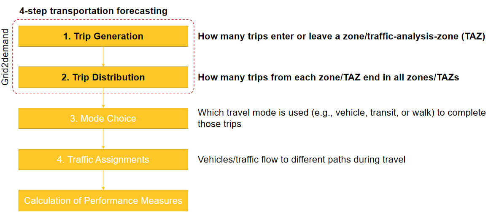

Trip generation is a procedure that uses socioeconomic data (e.g., household
size, income, etc.) to estimate the number of person trips for a modeled time
period (e.g., daily, peak hour) at a Traffic Analysis Zone (TAZ) level. A person
trip involves a single person leaving from an origin and arriving at a single
destination, and each trip has a classification/purpose based on typical
classification such as home-based-work (HBW), home-based-other (HBO), and
non-home-based (NHB).

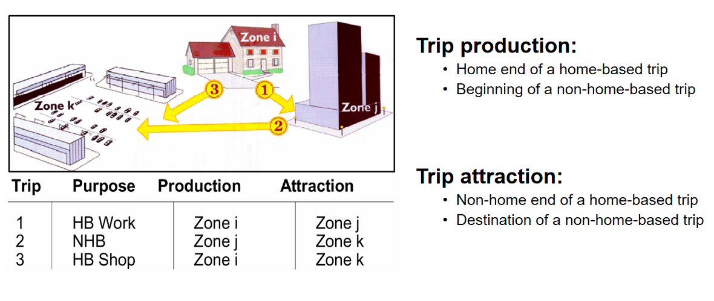

In the four-step process, there are two typical methods used to predict trips
based on attributes:

- [Trip rate method based on regression equations](#id.rjox6xhc6knq)
- [Cross-classification using category-based trip rates](#id.2d2g6gayq4ya)

After estimating the total number of trips produced, the trips are often
separated by different purposes (e.g., HBW, HBO, NHB).

An alternative approach to modeling trips is to model tours, which can be
thought of as a series of linked trips. Tours are typically used in
Activity-Based Models (ABM), where daily travel activities are generated based
on activity patterns for households.

**Productions and Attractions**

In trip-based transportation planning, for a home-based trip, a production is
related to the home end/location, while an attraction is related to the non-home
end/location. For a non-home-based trip, a production is related to the origin
location, and an attraction is related to the destination location. Trips
entering and leaving a zone should balance - if a person leaves a zone, they
should also return; if a person enters a zone, they should also leave.

For example, if a person travels from home to work and then from work to home on
a certain day, then 2 home-based work trip productions are generated at the home
TAZ, and two attractions related at his or her work location TAZ.

**Estimate Trip Productions/Attractions Using Trip Rates**

Productions are typically modeled as a function of population and/or number of
households, as well as income levels or auto ownership. Other explanatory
variables might be used, such as the number of workers, but we need to make sure
explanatory variables are often not interrelated and correlated with each other.

Attractions are often modeled as a function of the number of households and/or
number of employees, where employment may be broken down by different types
(e.g., retail, office, service, and other). Again, other explanatory variables
can also be used, such as commercial floor space or CBD (Central Business
District) variables, but the same checks for correlation between variables
should be utilized. Attractions tend to be more difficult to measure/estimate,
and we tend to have less trust in these estimates. For more information, users
can read [NCHRP Report 365: “Travel Estimation Techniques, CH 3 trip
generation](http://www.google.com/url?q=http%3A%2F%2Fntl.bts.gov%2Flib%2F21000%2F21500%2F21563%2FPB99126724.pdf&sa=D&sntz=1&usg=AFQjCNG2L127sploJ1a6_-ZmhSt6PnNypA)
and [NCHRP Report 716: Travel Demand Forecasting: Parameters and Techniques, CH
4.4 Trip
Generation](http://onlinepubs.trb.org/onlinepubs/nchrp/nchrp_rpt_716.pdf).

**Accessibility**

In transportation planning, accessibility is first defined as the potential of
opportunities for traveler interaction. the potential opportunity for traveler
interaction is positively associated with accessibility. Typically,
accessibility captures the extent of the attractiveness of each potential
destination and some researchers represent accessibility as the amount of
activity locations potentially reachable within a given travel time or distance
from an origin location.

One of the goals of transportation system construction and management is to
improve individuals’ accessibility or the ease of reaching desired activities,
destinations, and services. In general, quantitative accessibility measures
describe how many and how easily destinations can be reached from a particular
zone. For more information, users can check
[https://tfresource.org/topics/Accessibility.html](https://tfresource.org/topics/Accessibility.html).

**Trip distribution**

There are a variety of trip distribution formulations. Among recent travel
models, two formulations dominate: the gravity model and the destination choice
model.

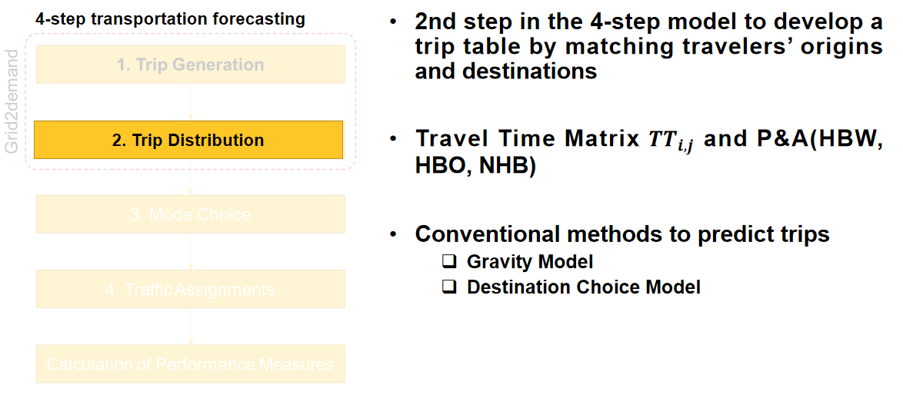

For each OD pair, a typical gravity model is applied to calculate zone-to-zone
demand volume. In the gravity model, the trips produced at an origin and
attracted to a destination are directly proportional to the total trip
productions at the origin and the total attractions at the destination with
"friction factor", which represents the reluctance or impedance of persons to
make trips of various

duration or distances. A gravity model may be “singly-constrained” or
“doubly-constrained”. For more information, please visit
https://tfresource.org/topics/Trip_distribution.html. and
http://www.princeton.edu/\~alaink/Orf467F12/The%20Gravity%20Model.pdf

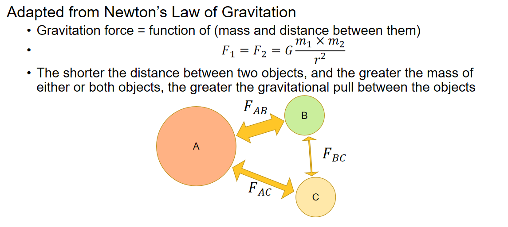

For each OD pair, a **gravity model** to calculate zone-to-zone demand volume is
formulated as follows.

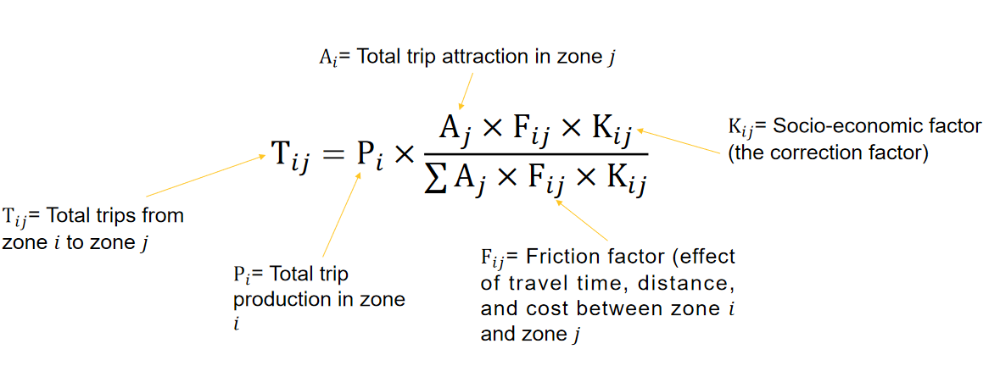


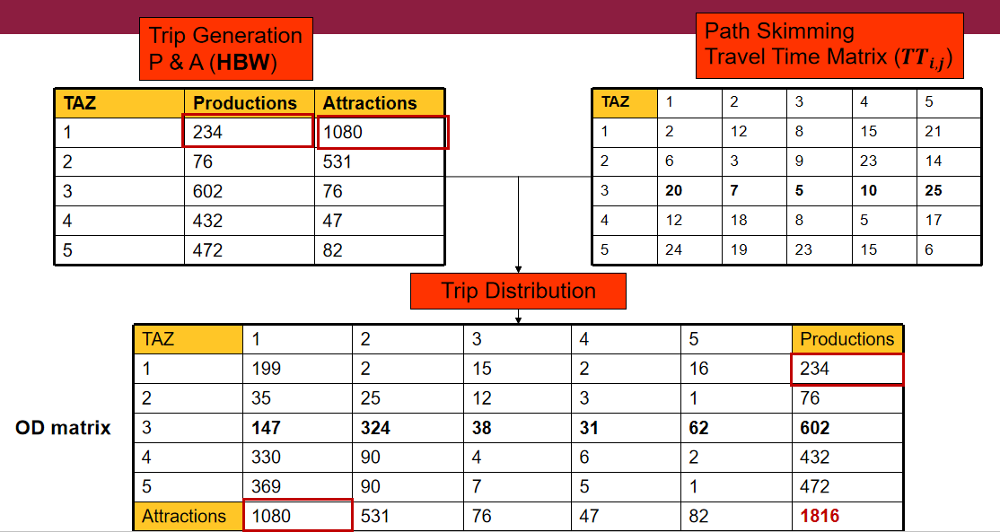

**II. What is grid2demand?**

Grid2demand is a quick demand generation tool based on the trip generation and
trip distribution methods of the standard 4-step travel model for teaching
transportation planning and applications. By taking advantage of the OSM2GMNS
tool to obtain a routable transportation network from OpenStreetMap, Grid2demand
aims to further utilize Point of Interest (POI) data to construct a trip demand
matrix aligned with standard travel models.

The area of interest is partitioned into an alphanumeric grid (also known as
atlas grid), in which each cell is identified by a combination of a letter and a
number. The trip generation step is performed at the POI node level using ITE
trip generation tables
(https://www.ite.org/technical-resources/topics/trip-and-parking-generation/trip-generation-10th-edition-formats/)
or other trip rate references.

When partitioning grid cells and calculating accessibility, World Geodetic
System-1984 Coordinate System is applied to convert coordinates to length. The
trip distribution is carried out using a typical gravity model. The data flow
chart is illustrated in the following table and figure.

**Description of Data Files**

| Step | Process                            | Input File or Parameter                                                                    | Output File                                                                                                        | Method                                                                  |
| ---- | ---------------------------------- | ------------------------------------------------------------------------------------------ | ------------------------------------------------------------------------------------------------------------------ | ----------------------------------------------------------------------- |
| 0    | Network files preparation          | map file from OpenStreetMap                                                                | *node.csv, link.csv, poi.csv*                                                                                    | Osm2gmns tool                                                           |
| 1    | Input files reading                | *node.csv, poi.csv*                                                                      |                                                                                                                    |                                                                         |
| 2    | Zone generation and grid partition | Number of blocks or grid scales in meters with latitude of the area of interest (optional) | *zone,csv, poi.csv* (update with zone id)                                                                        | Alphanumeric grid                                                       |
| 3    | Trip generation                    | *poi_trip_rate.csv* (optional), trip purpose                                             | *poi_trip_rate.csv* (output/update with utilization notes), *node.csv* (update with zone id and demand values) | Trip rate method                                                        |
| 4    | Accessibility calculation          | *accessibility.csv* (optional), latitude of the area of interest                         | *accessibility.csv*                                                                                              | Simple straight-line distance between zone centroids                    |
| 5    | Trip distribution                  | Trip purpose, friction factor coefficients                                                 | *demand.csv, zone,csv* (update with total production and attraction in each zone)                                | Gravity model                                                           |
| 6    | Agent generation                   | *demand.csv*                                                                             | *agent.csv*                                                                                                      | Random sampling of node-to-node agents according to zone-to-zone demand |
| 7    | Visualization                      |                                                                                            | QGIS or NEXTA                                                                                                      |                                                                         |

**Flowchart of grid2demand**

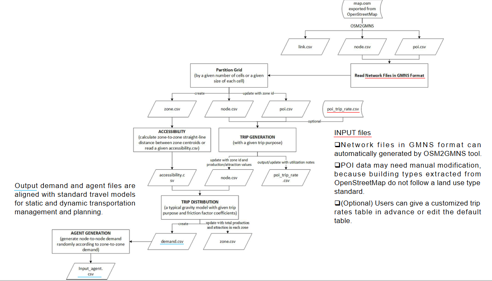

For the entire package, the input files include the network files in GMNS format
(*node.csv, link.csv*) as well as *poi.csv*, generated by the OSM2GMNS tool.

Users can download a default *poi_trip_rate.csv* from
https://github.com/asu-trans-ai-lab/grid2demand/blob/main/examples/data_folder/poi_trip_rate.csv
and apply further adjustments based on local traffic conditions.

The final output files include *zone.csv, accessibility.csv*, *demand.csv* for
zone-to-zone OD demand matrix, and *input_agent.csv* for node-to-node agent
files which can be used by agent-based simulators such as AB Street and DTALite.
Accordingly, *node.csv* and *poi.csv* are updated with assigned zone
information.

**Grid partition and zone creation**


To facilitate hierarchical and multi-resolution spatial computing, grid cells
are used to aggregate trips to traffic analysis zones, while standard TAZs are
typically defined based on census tracts. Users can specify the number of cells
per row and per column or the width and height of each grid cell (in meters) for
the area of interest. To maintain a consistent mapping, we use a fractional
value in terms of the degree at different latitudes to represent different
lengths on a flat surface. That is, a value of 0.01 longitudinal degrees at 60
degrees latitude is equivalent to 0.558 km on a flat surface. Thus, users can
provide a latitude value of the area of interest, and the software will identify
the closest latitude in the following table and use the equivalent distance to
measure for that area.


Moreover, some nodes in the network are marked as boundary nodes in *node.csv*
to describe the entrance or exit points with respect to the area of interest.
Thus, we add virtual zones around the grid area’s boundary to aggregate demand
from outside the area of interest, which are regarded as “gates” or external
stations.

**Trip generation**

To enable detailed modeling of trip generation from parking lots and buildings,
different types of POI nodes are specifically covered in file *poi.csv*,
extracted from the original *OSM file*. The user can supply more information in
*poi.csv* in case of missing values. The trip generation process used in
grid2demand has the following 3 sub-steps.

1. For each node, the amount of produced or attracted traffic is computed based
   on the underlying trip purpose and POI type, defined in *poi_trip_rate.csv.*
2. Update the field of production and attraction for each POI or boundary node
   in *node*.*csv*.
3. For each zone, its total production and attraction values can be calculated
   as the sum of node-based values across all nodes with the corresponding zone
   id.

A sample *poi_trip_rate* table is listed below.


For each boundary node (such as freeway or arterial’s endpoint at the boundary
of the area) which stands for a gate to enter or leave the area, the default
values of production and attraction are set to be 1000.

**Accessibility and distance computing**

In the current version, accessibility is measured by zone-to-zone straight-line
distance according to zone centroid coordinates. A more advanced version will be
provided in the future to use the shortest path algorithm for computing
end-to-end driving or multimodal travelling distance and costs.

**Trip distribution**

As mentioned above, a typical gravity model is applied to calculate zone-to-zone
demand volume. The trip purpose and friction factor coefficients can be defined
by users or by default. The default values under three typical trip purposes are
listed in the following table.


**OD demand estimation using link counts and different data sources**

In the future, output *demand.csv* can act as one of multiple data sources for a
hierarchical travel demand estimation and *input_agent.csv* can be directly used
for assignment by DTALite and for other travel models. For more information,
please visit
https://www.researchgate.net/publication/325131295_Hierarchical_travel_demand_estimation_using_multiple_data_sources_A_forward_and_backward_propagation_algorithmic_framework_on_a_layered_computational_graph.

**III. Quick start**

We will use the University of Maryland, College Park as an example to illustrate
how to use grid2demand.

**Step 1: Installation**

You can install the latest release of grid2demand at
[PyPI](https://pypi.org/project/pydriosm/)
(https://pypi.org/project/grid2demand/) via
[pip](https://packaging.python.org/key_projects/#pip):

\~\~\~\~\~\~\~\~\~\~\~\~\~\~\~\~\~\~\~\~\~\~\~\~\~\~\~\~\~\~\~\~\~\~\~\~\~\~\~\~\~\~\~\~\~\~\~\~\~\~\~\~\~\~\~\~\~\~\~\~\~\~\~

pip install grid2demand

\~\~\~\~\~\~\~\~\~\~\~\~\~\~\~\~\~\~\~\~\~\~\~\~\~\~\~\~\~\~\~\~\~\~\~\~\~\~\~\~\~\~\~\~\~\~\~\~\~\~\~\~\~\~\~\~\~\~\~\~\~\~\~

After running the command above, the grid2demand package along with two required
dependency packages (numpy, pandas) will be installed on your computer (if they
have not been installed yet).

**Step 2: Determine the boundary of interest and download .osm file from
OpenStreetMap (https://www.openstreetmap.org/)**

1. Adjust the map to the location of interest and click on the “Export” button
   on the top.


1. Obtain the latitude and longitude coordinates (users can “manually select a
   different area”).
2. Click on the “Export” button found in the middle of the navigator to
   download an OSM data file.
3. For a very large area of interest, users need to click the link of “Overpass
   API” to obtain a map file.


**Step 3: Execute OSM2GMNS to get network files in GMNS format**

Open the Python IDE, such as Pycharm, for a typical configuration. Then, use
OSM2GMNS to convert the *map.osm* file in OSM format into a network file in GMNS
format.

Notes: User guide for osm2gmns can be found at
https://osm2gmns.readthedocs.io/en/latest/.


Please note that *poi.csv* might have different degrees of missing information.
Please supply additional accurate POI-type information if needed.

**Step 4: Execute grid2demand Python code**

1. **Import the package and read input network data**

\~\~\~\~\~\~\~\~\~\~\~\~\~\~\~\~\~\~\~\~\~\~\~\~\~\~\~\~\~\~\~\~\~\~\~\~\~\~\~\~\~\~\~\~\~\~\~\~\~\~\~\~\~\~\~\~\~\~\~\~\~\~\~

```python
from grid2demand import GRID2DEMAND

input_dir = "Path-folder-to-your-node.csv-and-poi.csv"

gd = GRID2DEMAND(input_dir)
```

1. **Partition network into grid cells**

Users can customize the number of grid cells by setting “number_of_x_blocks” and
“number_of_y_blocks”. On the other hand, users can customize the cell’s width
and height in meters under the latitude of the area by setting “cell_width”,
“cell_height” and “latitude”).

By default, “cell_width” and “cell_height” are set as the length on a flat
surface under a specific latitude corresponding to the degree of 0.006
(equivalent to 400 meters or 0.25 miles at latitude = 45 degree).

\~\~\~\~\~\~\~\~\~\~\~\~\~\~\~\~\~\~\~\~\~\~\~\~\~\~\~\~\~\~\~\~\~\~\~\~\~\~\~\~\~\~\~\~\~\~\~\~\~\~\~\~\~\~\~\~\~\~\~\~\~\~\~

```python
node_dict, poi_dict = gd.load_network.values()

zone_dict = gd.net2zone(node_dict, num_x_blocks=10,num_y_blocks=10)

# Generate zone based on grid size with 10 km width and 10km height for each zone
# zone_dict = gd.net2zone(node_dict, cell_width=10, cell_height=10, unit="km")

# if you have your own zone.csv(TAZs), we can generate zones from your personal TAZs
# zone_dict = gd.taz2zone()


# Synchronize geometry info between zone, node and poi
#       add zone_id to node and poi dictionaries
#       also add node_list and poi_list to zone dictionary
updated_dict = gd.sync_geometry_between_zone_and_node_poi(zone_dict, node_dict, poi_dict)

zone_dict_update, node_dict_update, poi_dict_update = updated_dict.values()

```

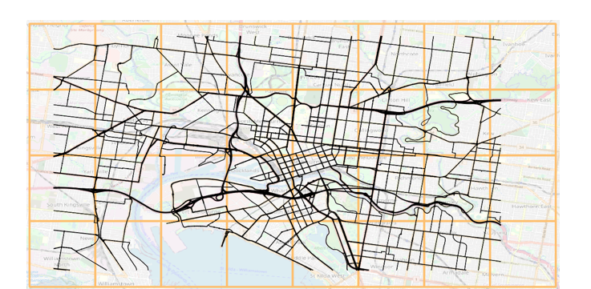

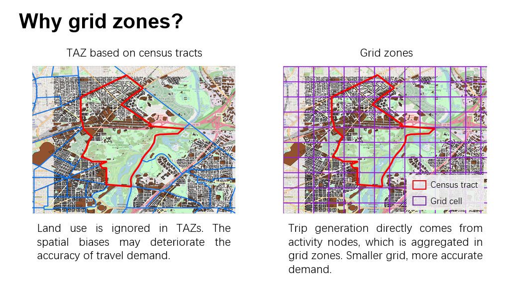

1. **Obtain production/attraction rates of each land use type with a specific
   trip purpose**

Users can customize *poi_trip_rate.csv* by adding an external file folder
location according to different trip purposes. By default, the trip purpose is
set as purpose 1.

\~\~\~\~\~\~\~\~\~\~\~\~\~\~\~\~\~\~\~\~\~\~\~\~\~\~\~\~\~\~\~\~\~\~\~\~\~\~\~\~\~\~\~\~\~\~\~\~\~\~\~\~\~\~\~\~\~\~\~\~\~\~\~

```
# Generate poi trip rate for each poi

poi_trip_rate = gd.gen_poi_trip_rate(poi_dict_update, trip_rate_file="", trip_purpose=1)
```


1. **Compute production/attraction value of each node according to POI type**

\~\~\~\~\~\~\~\~\~\~\~\~\~\~\~\~\~\~\~\~\~\~\~\~\~\~\~\~\~\~\~\~\~\~\~\~\~\~\~\~\~\~\~\~\~\~\~\~\~\~\~\~\~\~\~\~\~\~\~\~\~\~\~

```python
# Generate node production attraction for each node based on poi_trip_rate

node_prod_attr = gd.gen_node_prod_attr(node_dict_update, poi_trip_rate)

# Calculate zone production and attraction based on node production and attraction

zone_prod_attr = gd.calc_zone_prod_attr(node_prod_attr, zone_dict_update)

```


1. **Calculate zone-to-zone accessibility matrix by centroid-to-centroid
   straight-line distance**

Users need to input the latitude value of the area of interest. A latitude of 30
degrees is selected as the default. On the other hand, users can customize the
accessibility matrix by setting the external folder of file *accessibility.csv*.

\~\~\~\~\~\~\~\~\~\~\~\~\~\~\~\~\~\~\~\~\~\~\~\~\~\~\~\~\~\~\~\~\~\~\~\~\~\~\~\~\~\~\~\~\~\~\~\~\~\~\~\~\~\~\~\~\~\~\~\~\~\~\~

```python
# Calculate zone-to-zone od distance matrix

zone_od_distance_matrix = gd.calc_zone_od_distance_matrix(zone_dict_update)
```


1. **Apply gravity model to perform trip distribution**

Users need to input the trip purpose and the friction factor coefficients. The
default values of HBW, HBO and NHB are described above.

\~\~\~\~\~\~\~\~\~\~\~\~\~\~\~\~\~\~\~\~\~\~\~\~\~\~\~\~\~\~\~\~\~\~\~\~\~\~\~\~\~\~\~\~\~\~\~\~\~\~\~\~\~\~\~\~\~\~\~\~\~\~\~

```python
# Run gravity model to generate agent-based demand

df_demand = gd.run_gravity_model(zone_prod_attr, zone_od_distance_matrix)
```

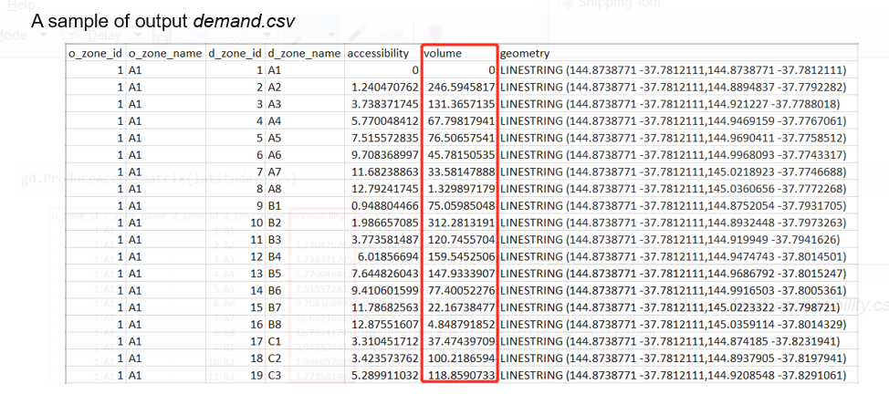

1. **Generate agent-based demand**

Agent-based node-to-node demand will be generated randomly according to
zone-to-zone demand obtained by the gravity model.

\~\~\~\~\~\~\~\~\~\~\~\~\~\~\~\~\~\~\~\~\~\~\~\~\~\~\~\~\~\~\~\~\~\~\~\~\~\~\~\~\~\~\~\~\~\~\~\~\~\~\~\~\~\~\~\~\~\~\~\~\~\~\~

```
# generate agent-based demand

df_agent = gd.gen_agent_based_demand(node_prod_attr, zone_prod_attr, df_demand=df_demand)
```

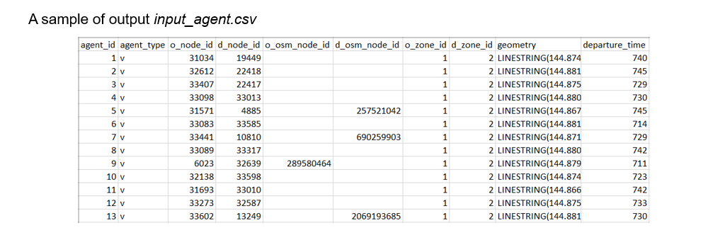

One can configure the working dictionary in the Python IDE (e.g., Pycharm)
before executing grid2demand. The files in the working folder will be used to
obtain zone-to-zone demand with generated five output files highlighted in blue
below. The output files will be saved in the current folder as the working
dictionary.

```python
# You can also view and edit the package setting by using gd.pkg_settings
print(gd.pkg_settings)

# Output demand, agent, zone, zone_od_dist_table, zone_od_dist_matrix files
gd.save_demand
gd.save_agent
gd.save_zone
gd.save_zone_od_dist_table
gd.save_zone_od_dist_matrix
```

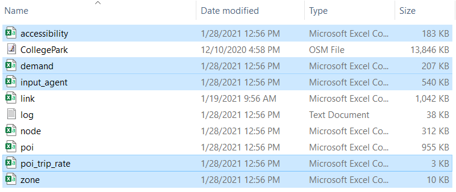

**Step 5: Visualization in QGIS**

Open QGIS and add Delimited Text Layer to load the *demand.csv* and other files
(with geometry info).

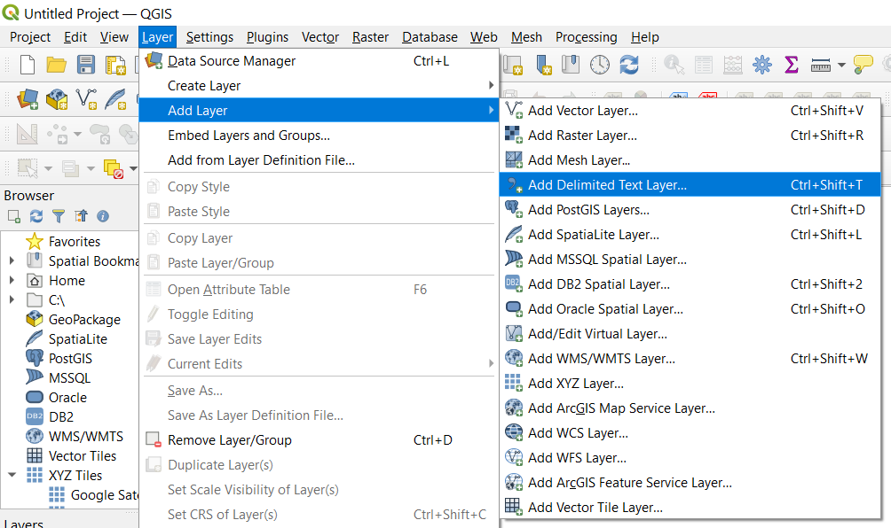

Then open the “Properties” window of the demand layer. Set the symbology as
graduated symbols by size.


The zone-to-zone demand volume can be visualized with a base map.

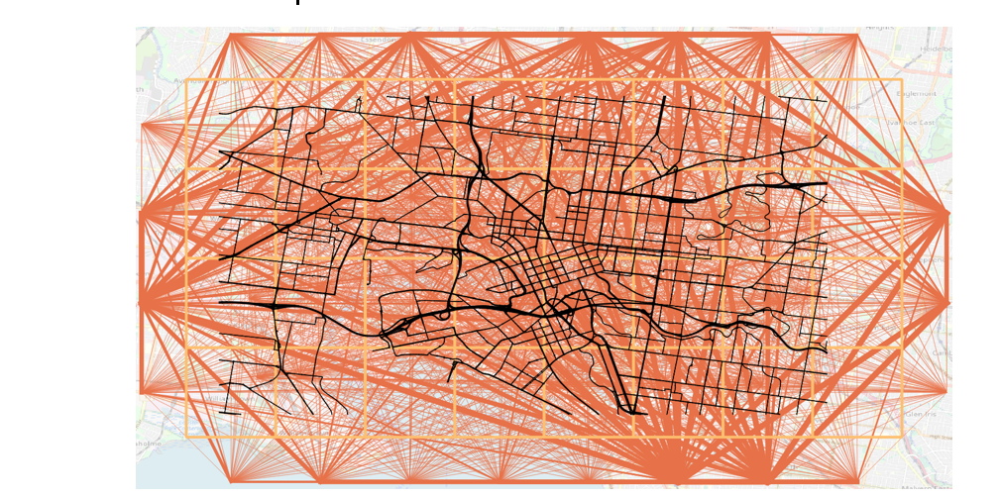
